# GitHub Webhook Automatisches Deployment

## 🎯 Überblick

Das automatische Deployment System reagiert auf Push Events im `live` Branch und aktualisiert den Server automatisch. Push Events zu `master` oder `main` werden ignoriert.

## 🔧 Setup Schritte

### 1. Server Vorbereitung

```bash
# Webhook Setup Script ausführen
cd ~/wannfahrma-v1
chmod +x scripts/deployment/setup-webhook.sh
./scripts/deployment/setup-webhook.sh
```

Das Script:
- ✅ Generiert sicheres Webhook Secret
- ✅ Konfiguriert Environment Variables
- ✅ Öffnet Firewall Port 3001
- ✅ Optional: Nginx Reverse Proxy Setup
- ✅ Startet PM2 Services (App + Webhook)

### 2. GitHub Repository Konfiguration

1. **GitHub Repository öffnen:**
   ```
   https://github.com/ochtii/wannfahrma-v1/settings/hooks
   ```

2. **"Add webhook" klicken**

3. **Webhook konfigurieren:**
   ```
   Payload URL: http://deine-server-ip:3001/webhook
   Content type: application/json
   Secret: [Der generierte Secret aus dem Setup]
   Which events: Just the push event
   Active: ✓
   ```

### 3. Domain Setup (Optional)

Für bessere Sicherheit mit Subdomain:

```bash
# DNS A-Record erstellen
hooks.example.com → Server-IP

# SSL Zertifikat mit Certbot
sudo certbot --nginx -d hooks.example.com
```

Dann in GitHub:
```
Payload URL: https://hooks.example.com/webhook
```

## 🎮 Verwendung

### Automatisches Deployment

```bash
# Auf dem entwicklungsrechner
git checkout live
git add .
git commit -m "Update feature"
git push origin live
```

➡️ **Server wird automatisch aktualisiert!**

### Deployment nur bei live Branch

```bash
# Diese Aktionen triggern KEIN Deployment
git checkout master
git push origin master

git checkout main  
git push origin main
```

➡️ **Keine Server-Änderung**

## 📊 Monitoring & Testing

### Status überprüfen

```bash
# PM2 Services Status
pm2 status

# Webhook Service Health Check
curl http://localhost:3001/webhook/health

# Webhook Logs
pm2 logs wannfahrma-webhook

# Deployment Logs
tail -f logs/webhook.log
```

### Manual Deployment Test

```bash
# Force Deployment (nur für Tests)
curl -X POST http://localhost:3001/webhook/deploy \
     -H "Content-Type: application/json" \
     -d '{}'
```

### GitHub Webhook Test

In GitHub Repository Settings → Webhooks:
- ✅ Recent Deliveries anzeigen
- ✅ Response Codes überprüfen
- ✅ Redeliver Payloads

## 🔒 Sicherheit

### Webhook Secret Verification

- ✅ Alle Webhooks werden mit HMAC-SHA256 verifiziert
- ✅ Ungültige Signatures werden abgelehnt
- ✅ Secret wird in `.env` gespeichert (nicht in Git)

### Branch Protection

- ✅ Nur `live` Branch kann Deployments triggern
- ✅ `master`/`main` Branches werden ignoriert
- ✅ Alle anderen Branches werden ignoriert

### Firewall & Access

```bash
# Port 3001 nur für GitHub IPs öffnen (optional)
sudo ufw delete allow 3001
sudo ufw allow from 140.82.112.0/20 to any port 3001 comment "GitHub Webhooks"
sudo ufw allow from 143.55.64.0/20 to any port 3001 comment "GitHub Webhooks"
sudo ufw allow from 192.30.252.0/22 to any port 3001 comment "GitHub Webhooks"
sudo ufw allow from 185.199.108.0/22 to any port 3001 comment "GitHub Webhooks"
```

## 🚨 Troubleshooting

### Webhook funktioniert nicht

1. **Service Status prüfen:**
   ```bash
   pm2 status
   curl http://localhost:3001/webhook/health
   ```

2. **GitHub Webhook Logs:**
   - GitHub → Settings → Webhooks
   - Recent Deliveries prüfen
   - Response Code sollte 200 sein

3. **Server Logs:**
   ```bash
   pm2 logs wannfahrma-webhook
   tail -f logs/webhook.log
   ```

### Deployment schlägt fehl

1. **Git Status prüfen:**
   ```bash
   cd ~/wannfahrma-v1
   git status
   git pull origin live
   ```

2. **PM2 Neustart:**
   ```bash
   pm2 restart wannfahrma-webhook
   pm2 restart wannfahrma
   ```

3. **Manuelle Deployment:**
   ```bash
   npm install
   pm2 restart wannfahrma
   ```

### Port 3001 blockiert

```bash
# Firewall Status
sudo ufw status

# Port freigeben
sudo ufw allow 3001

# Nginx neu laden (falls verwendet)
sudo nginx -t
sudo systemctl reload nginx
```

## 📋 Konfiguration

### Environment Variables

```bash
# .env Datei
WEBHOOK_PORT=3001
WEBHOOK_SECRET=your-secure-secret-here
APP_DIR=/home/user/wannfahrma-v1
```

### PM2 Ecosystem

```javascript
// ecosystem-with-webhook.config.js
module.exports = {
  apps: [
    {
      name: 'wannfahrma',
      script: 'server.js',
      env: { PORT: 3000 }
    },
    {
      name: 'wannfahrma-webhook',
      script: 'webhook-listener.js',
      env: { PORT: 3001 }
    }
  ]
}
```

## 🎉 Workflow

```mermaid
graph LR
    A[Dev Push zu live] --> B[GitHub Webhook]
    B --> C[Server Webhook]
    C --> D[Signature Check]
    D --> E[Branch Check]
    E --> F[git pull]
    F --> G[npm install]
    G --> H[PM2 restart]
    H --> I[✅ Live Update]
```



**Fertig! Der Server aktualisiert sich automatisch bei jedem Push zum `live` Branch.**
